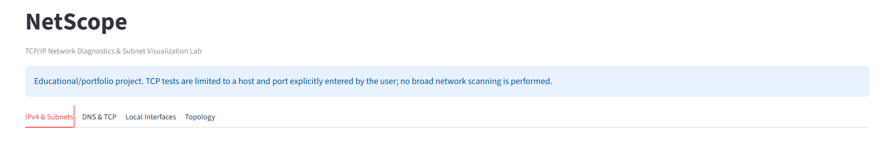
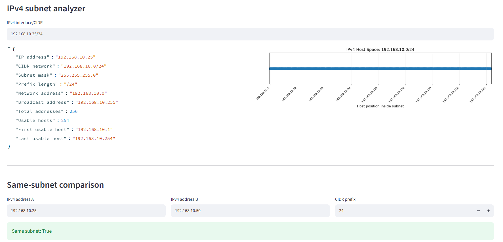
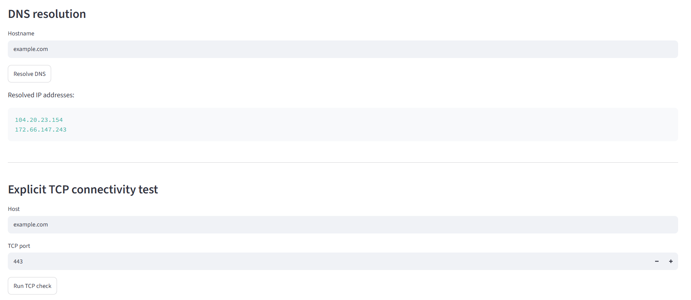
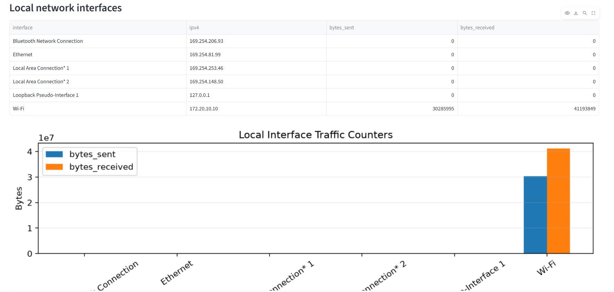
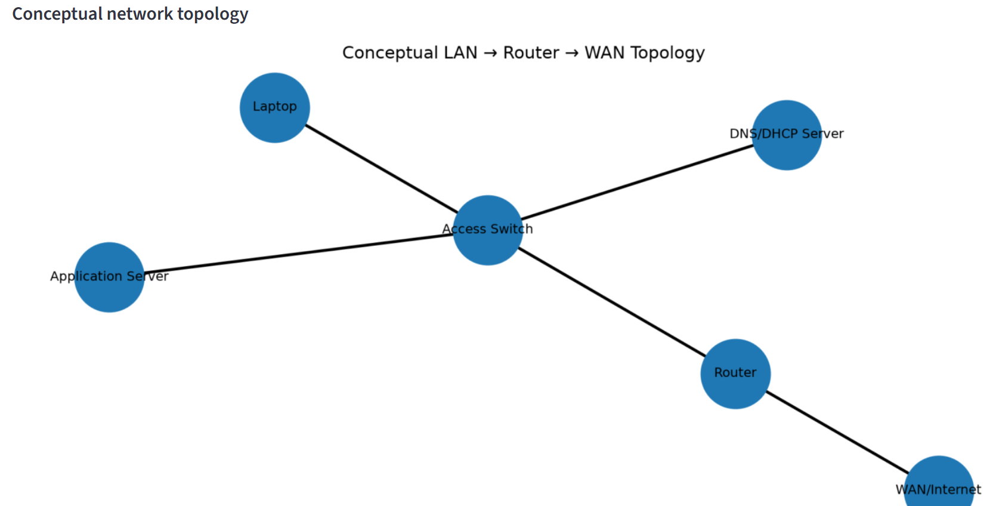
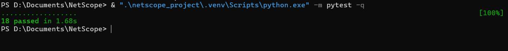

# NetScope — TCP/IP Network Diagnostics & Subnet Visualization Lab


**NetScope** is a modular Python TCP/IP network diagnostics and visualization laboratory for analysing IPv4 addressing, CIDR subnetting, DNS resolution, TCP connectivity, local network interfaces, and conceptual network topology.

The project combines networking concepts with working Python implementation, a Streamlit dashboard, automated testing, visualization, documentation, and continuous integration.

> **Project scope:** NetScope is designed for educational, development, troubleshooting, and authorized diagnostic use. TCP connectivity checks operate only against a host and port explicitly supplied by the user. The current implementation does not perform broad or automated Internet-wide scanning.

---

## Project Overview

NetScope provides a small but extensible network-diagnostics architecture that separates application presentation from networking logic, local interface inspection, visualization, and automated testing.

The project demonstrates how fundamental TCP/IP concepts can be translated into reusable software components rather than treated only as theoretical networking topics.

### Core capabilities

* IPv4 address and CIDR analysis
* Network and broadcast address calculation
* Subnet mask and prefix analysis
* Usable-host calculation
* Same-subnet comparison
* DNS hostname resolution
* Explicit TCP connectivity testing
* Local network-interface inventory
* Interface traffic-counter inspection
* Subnet visualization
* Interface traffic visualization
* Conceptual LAN/WAN topology visualization
* Modular Python architecture
* Automated unit testing with pytest
* GitHub Actions continuous integration
* Responsible-use and diagnostic-scope documentation

---

## Dashboard

NetScope provides a Streamlit-based interface for interacting with the networking modules.



---

## Technical Capabilities

### 1. IPv4 and CIDR Analysis

NetScope uses Python's standard `ipaddress` library to analyse IPv4 interface/network inputs such as:

```text
192.168.10.25/24
```

The analyzer derives:

* IP address
* CIDR network
* subnet mask
* prefix length
* network address
* broadcast address
* total address count
* usable host count
* first usable host
* last usable host

Example:

```text
Input:
192.168.10.25/24

Network:
192.168.10.0/24

Subnet mask:
255.255.255.0

Broadcast:
192.168.10.255

Usable hosts:
254
```



Implementation:

```text
netscope_project/src/networking.py
```

---

### 2. Same-Subnet Analysis

The project compares two IPv4 addresses against a specified CIDR prefix to determine whether they belong to the same logical subnet.

Example:

```text
Address A: 192.168.10.25
Address B: 192.168.10.50
Prefix:    /24

Result:
Same subnet: True
```

The implementation validates:

* CIDR prefix range
* IPv4 address format
* IPv4-only operation

This provides a direct software implementation of a fundamental network-engineering operation.

---

### 3. DNS Diagnostics

NetScope uses Python sockets to resolve explicitly supplied hostnames and return unique resolved addresses.

Example:

```text
Hostname:
example.com

Resolved addresses:
...
```

The implementation also validates empty hostnames and exposes resolution failures to the application layer.

---

### 4. TCP Connectivity Diagnostics

NetScope provides an explicit TCP connectivity check against a user-specified host and port.

Example:

```text
Host: example.com
Port: 443

TCP OPEN/REACHABLE: example.com:443
```

The implementation uses Python TCP sockets with configurable timeout handling and validates the destination port range.

The diagnostic is intentionally bounded to an explicitly supplied destination rather than implementing broad network scanning.



Implementation:

```text
netscope_project/src/networking.py
```

---

### 5. Local Network Interface Monitoring

NetScope uses `psutil` to inspect locally available network interfaces and operating-system traffic counters.

The interface layer collects:

* interface name
* IPv4 address
* bytes sent
* bytes received

The application then converts these values into a visual traffic summary.



Implementation:

```text
netscope_project/src/interfaces.py
```

> Interface information is collected from the local operating system. It is not equivalent to packet-level capture or deep packet inspection.

---

### 6. Network Visualization

The project includes multiple visualization components.

#### Subnet visualization

Displays host positions within a selected IPv4 subnet.

#### Interface traffic visualization

Plots local interface byte counters.

#### Conceptual network topology

Uses NetworkX to model a simplified network containing endpoints, switching, routing, WAN connectivity and local services.



The topology is conceptual and is not intended to represent the physical topology of the machine on which NetScope is executed.

---

## Architecture

NetScope follows a modular application structure:

```text
                         User
                           |
              +------------+------------+
              |                         |
        Streamlit UI                 CLI
          app.py                    main.py
              |                         |
              +------------+------------+
                           |
                    Application Logic
                           |
          +----------------+----------------+
          |                |                |
    networking.py    interfaces.py     visuals.py
          |                |                |
       ipaddress         psutil       matplotlib
       socket                           networkx
          |
    IPv4 / CIDR
    DNS
    TCP
```

### Repository structure

```text
NetScope/
│
├── .github/
│   └── workflows/
│       └── tests.yml
│
├── .gitignore
├── LICENSE
├── README.md
├── pytest.ini
│
└── netscope_project/
    ├── app.py
    ├── main.py
    ├── requirements.txt
    │
    ├── docs/
    │   ├── architecture.md
    │   ├── github-description.txt
    │   ├── networking-concepts.md
    │   ├── roadmap.md
    │   ├── SECURITY.md
    │   └── testing.md
    │
    ├── results/
    │   ├── interface_traffic_visualization.png
    │   ├── subnet_visualization.png
    │   └── topology_visualization.png
    │
    ├── screenshots/
    │   ├── netscope_dashboard_overview.png
    │   ├── ipv4_subnet_analysis.png
    │   ├── dns_tcp_diagnostics.png
    │   ├── local_interface_monitoring.png
    │   ├── network_topology.png
    │   └── automated_tests.png
    │
    ├── src/
    │   ├── __init__.py
    │   ├── interfaces.py
    │   ├── networking.py
    │   └── visuals.py
    │
    └── tests/
        ├── test_interfaces.py
        ├── test_networking.py
        └── test_visuals.py
```

---

## Technologies

| Area                 | Technology         |
| -------------------- | ------------------ |
| Programming language | Python             |
| Web interface        | Streamlit          |
| IP addressing        | Python `ipaddress` |
| Network sockets      | Python `socket`    |
| Interface telemetry  | psutil             |
| Data processing      | pandas             |
| Visualization        | Matplotlib         |
| Network graphs       | NetworkX           |
| Testing              | pytest             |
| CI/CD                | GitHub Actions     |
| Version control      | Git / GitHub       |

---

## Testing

NetScope uses automated tests to validate networking logic, interface processing, and visualization behavior.

Current test areas include:

* IPv4 subnet calculations
* CIDR validation
* same-subnet comparison
* IPv4/IPv6 validation
* DNS input validation
* TCP port validation
* TCP connectivity behavior
* network-interface processing
* missing IPv4 interface handling
* subnet visualization
* interface traffic visualization
* topology visualization

Run the complete test suite from the repository root:

```powershell
python -m pytest -q
```

Current local baseline:

```text
18 passed
```



---

## Continuous Integration

GitHub Actions automatically executes the test suite for changes pushed to `main` and for pull requests targeting `main`.

The CI workflow:

1. Checks out the repository
2. Configures Python 3.12
3. Installs dependencies from `netscope_project/requirements.txt`
4. Executes the pytest suite

Workflow:

```text
.github/workflows/tests.yml
```

---

## Installation

### Requirements

* Python 3.11+
* Windows, Linux, or macOS
* Internet access for package installation and external DNS/TCP demonstrations

### Windows PowerShell

From the project directory:

```powershell
cd netscope_project

python -m venv .venv

.\.venv\Scripts\Activate.ps1

python -m pip install --upgrade pip

pip install -r requirements.txt
```

### Run the Streamlit dashboard

```powershell
streamlit run app.py
```

Open the local URL displayed by Streamlit, normally:

```text
http://localhost:8501
```

### Run the command-line interface

```powershell
python main.py
```

### Run tests

From the repository root:

```powershell
python -m pytest -q
```

---

## Documentation

Additional technical documentation is available under:

```text
netscope_project/docs/
```

### Documentation areas

* [Architecture](netscope_project/docs/architecture.md)
* [Networking Concepts](netscope_project/docs/networking-concepts.md)
* [Testing](netscope_project/docs/testing.md)
* [Security Policy](netscope_project/docs/SECURITY.md)
* [Roadmap](netscope_project/docs/roadmap.md)

---

## Responsible Use and Security

NetScope is intended for:

* learning
* development
* troubleshooting
* authorized network diagnostics
* controlled laboratory environments

The current implementation does not provide:

* credential attacks
* password cracking
* malware
* persistence
* exploit delivery
* arbitrary remote command execution
* unauthorized access
* automated Internet-wide scanning

See [SECURITY.md](netscope_project/docs/SECURITY.md) for the project's responsible-use scope.

---

## Current Limitations

NetScope is currently a focused diagnostic laboratory rather than a production network-management platform.

Current limitations include:

* IPv4-focused subnet analysis
* TCP checks are limited to explicitly supplied destinations
* no packet capture engine
* no packet-level protocol analysis
* no persistent telemetry database
* no multi-user authentication
* no centralized monitoring server
* topology visualization is conceptual
* interface counters represent operating-system statistics rather than packet captures

These limitations define the current boundary of the project and provide a basis for future development.

---

## Development Roadmap

### Networking depth

* IPv6 address and subnet analysis
* routing-table inspection
* DHCP lease analysis/simulation
* VLAN and 802.1Q modelling
* controlled ICMP diagnostics

### Observability

* time-series interface metrics
* historical telemetry storage
* threshold-based alerts
* structured JSON logging
* diagnostic result export

### Platform development

* REST/FastAPI service layer
* persistent database
* role-based access control
* Docker deployment
* API documentation

### Advanced analysis

* PCAP import for user-supplied captures
* protocol-level analysis
* network anomaly detection
* network change tracking

All future diagnostic/security functionality should remain within authorized and controlled environments.

---

## Portfolio Evidence

NetScope demonstrates practical application of:

```text
TCP/IP Networking
        +
Python Software Engineering
        +
Network Diagnostics
        +
Operating-System Telemetry
        +
Data Visualization
        +
Automated Testing
        +
Continuous Integration
```

The project is intended to demonstrate implementation ability across networking, Python development, testing, visualization, documentation, and software-engineering practices.

---

## License

This project is licensed under the MIT License.

See [LICENSE](LICENSE) for details.
